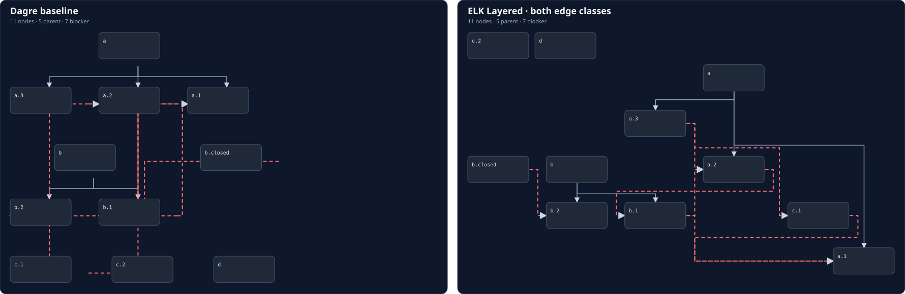

# ELK graph layout spike

Date: 2026-09-18
Issue: `bsm-1zl.10`

## Decision

Do not replace the production Graph renderer with ELK yet. Keep the extracted Dagre adapter as the production path and retain the ELK adapter as a comparison seam for a later focused experiment.

ELK Layered materially improves the fixture's blocker routing: it sees both relationship classes, respects explicit top/bottom and left/right ports, emits orthogonal edge sections, and reduced the measured edge-through-node cases from 5 unique edge/node pairs to 0. It also reduced the fixture's segment crossings from 3 to 1. The tradeoff is that the resulting layout moves the hierarchy to make cross-cutting blocker edges fit, which conflicts with the current product contract that parent links determine layout and blocker links do not influence positions. The remaining crossing is also evidence that ELK is not a complete comprehension solution for cyclic, cross-tree dependencies.

The next production experiment should be a product decision about relaxing that contract, followed by a real Graph-view comparison with user-facing labels and the expected focused-graph density. This spike does not silently make that contract change.

## Tested fixture

`src/issues/issue-graph-layout-fixture.ts` builds the same `FocusedIssueGraph` for both engines:

- 11 visible Issues, 5 parent edges, and 7 blocker edges.
- Two explicit parent trees plus disconnected components.
- Cross-tree blockers, sibling blockers, a closed blocker, and one blocker cycle (`bsm-fixture-a.2` ↔ `bsm-fixture-b.1`).
- A duplicate blocker declaration, which the semantic projection deduplicates.
- One missing blocker endpoint, retained as a structured anomaly.

The fixture intentionally exercises layout and projection separately. No relationship is inferred from a dotted Issue ID, and all blocker edges come from `blockedBy`.

## Strategies

### A — ELK sees both edge classes

`layoutIssueGraphWithElk({ graph })` passes parent and blocker edges to ELK Layered. Every Issue has four explicit ports:

- parent target: north;
- parent source: south;
- blocker target: west;
- blocker source: east.

The graph uses downward layered layout, orthogonal routing, fixed port order, crossing minimization, separated connected components, and explicit edge/node spacing. ELK's returned edge sections are preserved in the layout result rather than reconstructed as generic paths.

### B — ELK lays out only the hierarchy

`layoutIssueGraphWithElk({ graph, includeBlockers: false })` produces the hierarchy-only comparison: 5 parent edges and no blocker routes. The spike did not invent a hidden-node workaround because the official elkjs discussion describes edge routing as part of the layered layout rather than a standalone routing mode. That means this strategy cannot satisfy the requirement to route blockers with awareness of the hierarchy positions without adding a separate router or changing the layout contract.

### C — current Dagre adapter

`layoutIssueGraphWithDagre(graph)` preserves the current per-parent-component Dagre layout and deterministic row packing. It now lives in the same pure `issue-graph-layout.ts` seam as ELK so the comparison does not couple the React renderer to either engine.

## Measurements

The comparison command was run against the fixture after warm-up:

```sh
pnpm exec tsx scripts/render-elk-graph-spike.ts
```

The layout module records both engine identity and execution time. One observed run reported approximately 6.7 ms for the Dagre adapter and 0.06 ms of ELK's reported Layered execution time for this 11-node graph. These are small-graph measurements, not a basis for choosing a worker. ELK's public API is async and supports a Web Worker, so worker evaluation should wait until real focused graphs demonstrate a renderer blocking problem.

| Diagnostic              | Dagre baseline | ELK, both edge classes |
| ----------------------- | -------------: | ---------------------: |
| Node overlaps           |              0 |                      0 |
| Edge/node-through cases | 8 unique pairs |                      0 |
| Segment crossings       |              3 |                      1 |
| Duplicate edge IDs      |              0 |                      0 |
| Missing endpoints       |              1 |                      1 |
| Blocker cycle detected  |              1 |                      1 |
| Connected components    |              3 |                      3 |

The missing endpoint and cycle counts are semantic graph diagnostics and remain unchanged across layout engines. ELK breaks cycles internally and returns a finite layout; it does not remove the product-level cycle anomaly.

## Visual artifact

The deterministic side-by-side SVG comparison is checked in at [`elk-graph-layout-spike.svg`](./elk-graph-layout-spike.svg). It renders the same fixture with the Dagre baseline on the left and ELK Layered with both edge classes on the right. Recreate it with the command above.



The image shows the core tradeoff: Dagre preserves the clean parent hierarchy but lets blocker routes pass through unrelated cards; ELK reserves route space and avoids those cards but makes the overall hierarchy less compact and still leaves a crossing in the cyclic/cross-tree case.

## Implementation seam

- `issue-graph.ts` remains the semantic projection and anomaly source.
- `issue-graph-layout.ts` owns Dagre conversion, ELK conversion, explicit ports, edge sections, async ELK behavior, and geometry diagnostics.
- `IssueGraphCanvas.tsx` now maps the Dagre layout result into React Flow and does not contain engine-specific graph construction or packing policy.
- The production renderer remains on Dagre. No async loading state, worker, or user-visible layout change was introduced by this spike.

## Primary references

- [elkjs README and API](https://github.com/kieler/elkjs) — graph shape, `ELK#layout`, layout options, execution-time measurement, and Web Worker support.
- [ELK layout options](https://eclipse.dev/elk/reference/options.html) — Layered routing, spacing, crossing minimization, and port options.
- [elkjs issue #197](https://github.com/kieler/elkjs/issues/197) — evidence for the limitation around using Layered edge routing independently of another node-layout algorithm.
